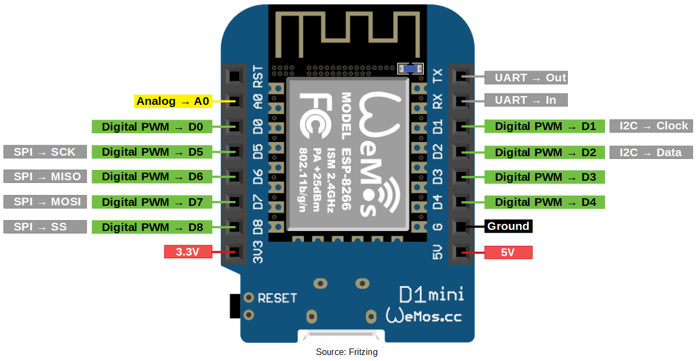

# Arduino

## Instalasi IDE

Panduan instalasi untuk:
- Linux <https://www.arduino.cc/en/Guide/Linux>
- Windows <https://www.arduino.cc/en/Guide/Windows>
- Portable <https://www.arduino.cc/en/Guide/PortableIDE>

Jika port serial tidak dikenali pada Linux, tambahkan *user* ke grup
`dialout` dengan perintah berikut, lalu logout.

```sh
sudo adduser $USER dialout
```

## Setting Board Selain Uno

### Arduino Nano

- *Tools -- Board -- Arduino Nano*
- *Tools -- Processor -- ATmega328P (Old Bootloader)*
- *Tools -- Serial Port -- /dev/ttyUSB0*

### Wemos D1 mini (ESP8266)

- *File -- Preferences -- Additional Board --* <https://arduino.esp8266.com/stable/package_esp8266com_index.json>
- *Tools -- Board -- Board Managers -- esp8266 -- Install*
- *Tools -- Board -- LOLIN(WEMOS) D1 R2 & mini*
- *Tools -- Serial Port -- /dev/ttyUSB0*

## Referensi Bahasa Pemrograman

<https://www.arduino.cc/reference>

## Pinout

### Arduino Uno


### Arduino Nano


### WeMos D1 mini


