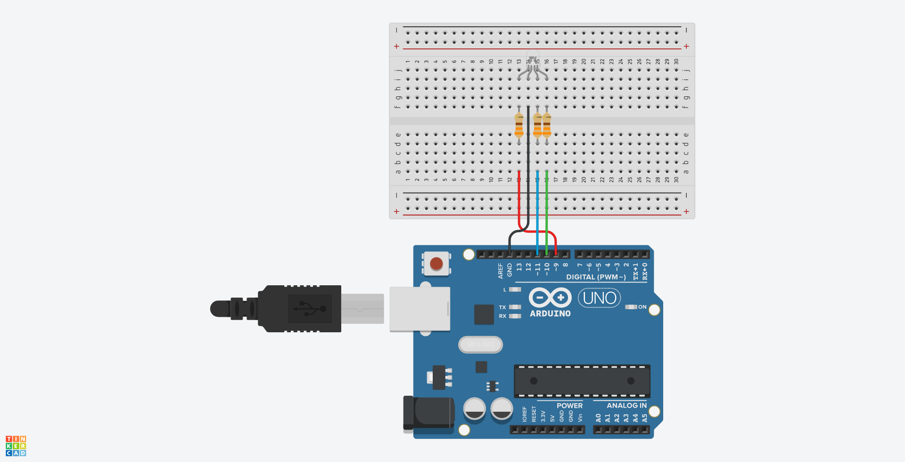

# 03. RGB LED



```ino
/*  03  RGB LED
        use PWM pin to set LED intensity with analogWrite()
*/
#define RED   9
#define GREEN 10
#define BLUE  11

void setup() {}

void loop() {
  mainColors();             // RGB,CMYK
  spectrum();               // HSV 360' hues
}

void mainColors() {
  for (int i = 0; i < 8; i++) {
    digitalWrite(RED,   bitRead(i, 0));
    digitalWrite(GREEN, bitRead(i, 1));
    digitalWrite(BLUE,  bitRead(i, 2));
    delay(1000);
  }
}

void spectrum() {
  for (int hue = 0; hue < 360; hue++) {
    setRGB(hue);
    delay(10);
  }
}

// convert HSV hue to RGB (saturation and value are set to 100%)
void setRGB(int hue) {
  int r, g, b;
  hue = constrain(hue, 0, 359);

  if      (hue < 60)  { r = 255; b = 0; g =        hue      * 4.25; }
  else if (hue < 120) { g = 255; b = 0; r = 255 - (hue- 60) * 4.25; }
  else if (hue < 180) { g = 255; r = 0; b =       (hue-120) * 4.25; }
  else if (hue < 240) { b = 255; r = 0; g = 255 - (hue-180) * 4.25; }
  else if (hue < 300) { b = 255; g = 0; r =       (hue-240) * 4.25; }
  else if (hue < 360) { r = 255; g = 0; b = 255 - (hue-300) * 4.25; }

  analogWrite(RED,   r);
  analogWrite(GREEN, g);
  analogWrite(BLUE,  b);
}
```
