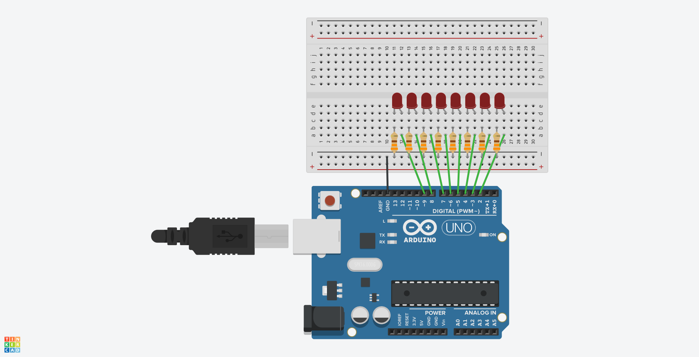

# 04. Multiple LED



```ino
/*  04. Multiple LED  */

#define N 8
int LED[N] = {2, 3, 4, 5, 6, 7, 8, 9};

void setup() {
  for (int i = 0; i < N; i++)
    pinMode(LED[i], OUTPUT);
}

void loop() {
  oneAfterAnother();
  //oneOnAtATime();
  //pingPong();
  //randomLED();
}

void oneAfterAnother() {
  for (int i = 0; i < N; i++) {
    digitalWrite(LED[i], HIGH);
    delay(100);
  }
  for (int i = N-1; i >= 0; i--) {
    digitalWrite(LED[i], LOW);
    delay(100);
  }
}

void oneOnAtATime() {
  for (int i = 0; i < N; i++) {
    digitalWrite(LED[i], HIGH);
    delay(100);
    digitalWrite(LED[i], LOW);
  }
}

void pingPong() {
  for (int i = 0; i < N; i++) {
    digitalWrite(LED[i], HIGH);
    delay(100);
    digitalWrite(LED[i], LOW);
  }
  for (int i = N-1; i >= 0; i--) {
    digitalWrite(LED[i], HIGH);
    delay(100);
    digitalWrite(LED[i], LOW);
  }
}

void randomLED() {
  int i = random(N);
  digitalWrite(LED[i], HIGH);
  delay(100);
  digitalWrite(LED[i], LOW);
}
```
