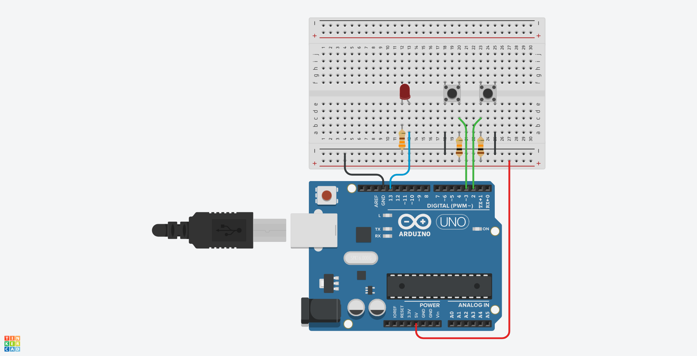

# 05. Push buttons



```ino
/*  05. Push buttons */

#define BUTTON1 2
#define BUTTON2 3
#define LED     13

void setup() {
  pinMode(BUTTON1, INPUT);
  pinMode(BUTTON2, INPUT);
  pinMode(LED, OUTPUT);
}

void loop() {
  int s1 = digitalRead(BUTTON1);
  int s2 = digitalRead(BUTTON2);

  // if button1 or button2 are pressed (LOW), but not both
  if (((s1 == LOW) && (s2 == HIGH)) || ((s1 == HIGH) && (s2 == LOW)))
    digitalWrite(LED, HIGH);
  else
    digitalWrite(LED, LOW);
}
```
