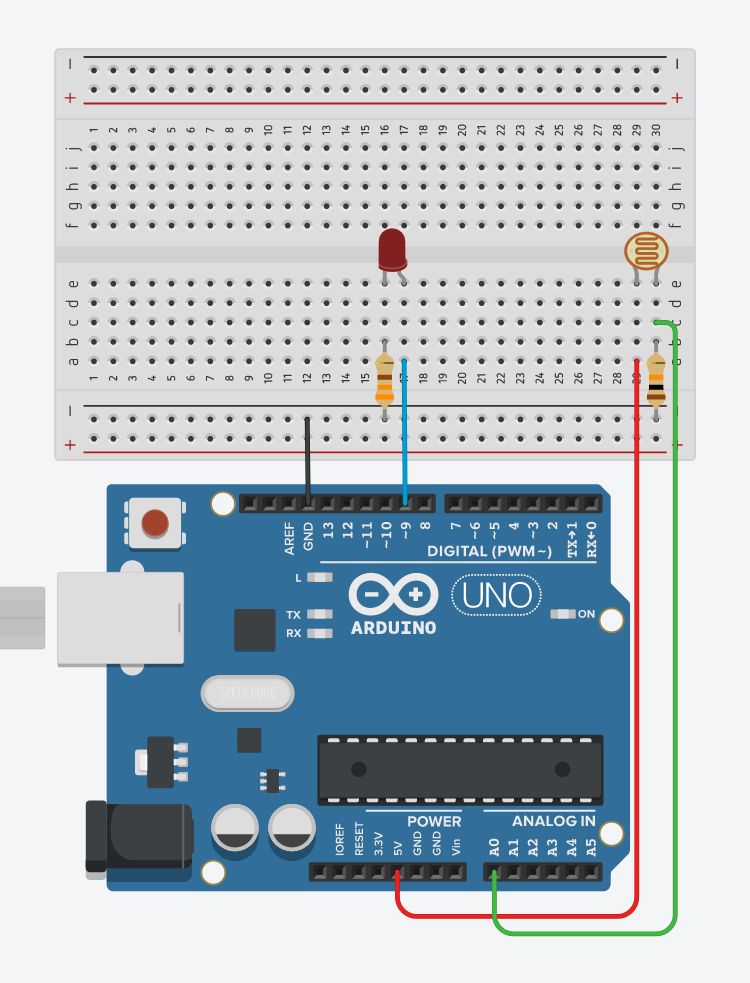

# 06. Photoresistor



```ino
/*  06. Photoresistor
        https://tinyurl.com/yerrf5nd
*/
#define LED  9

void setup() {
  pinMode(LED, OUTPUT);
  Serial.begin(9600);
}

void loop() {
  int light = analogRead(A0);                   // 10-bit
  int level = map(light, 0, 1023, 0, 255);      // map 0--1023 to 0--255

  Serial.print(light);
  Serial.print(", ");
  Serial.println(level);

  analogWrite(LED, level);                      // 8-bit
}
```
