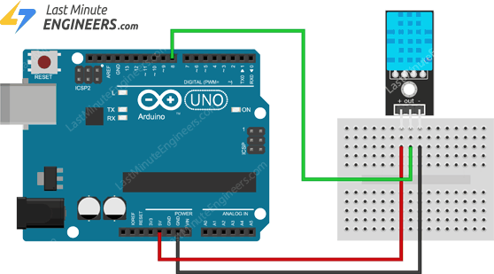

# 07. Temperature sensor DHT11



```ino
/*  07. DHT11 temperature sensor
        https://lastminuteengineers.com/dht11-module-arduino-tutorial
*/

#include <dht.h>                        // DHTlib

dht dht11;

void setup() {
  Serial.begin(9600);
}

void loop() {
  dht11.read11(8);

  Serial.print(dht11.temperature);
  Serial.print(", ");
  Serial.println(dht11.humidity);

  delay(2000);
}
```
