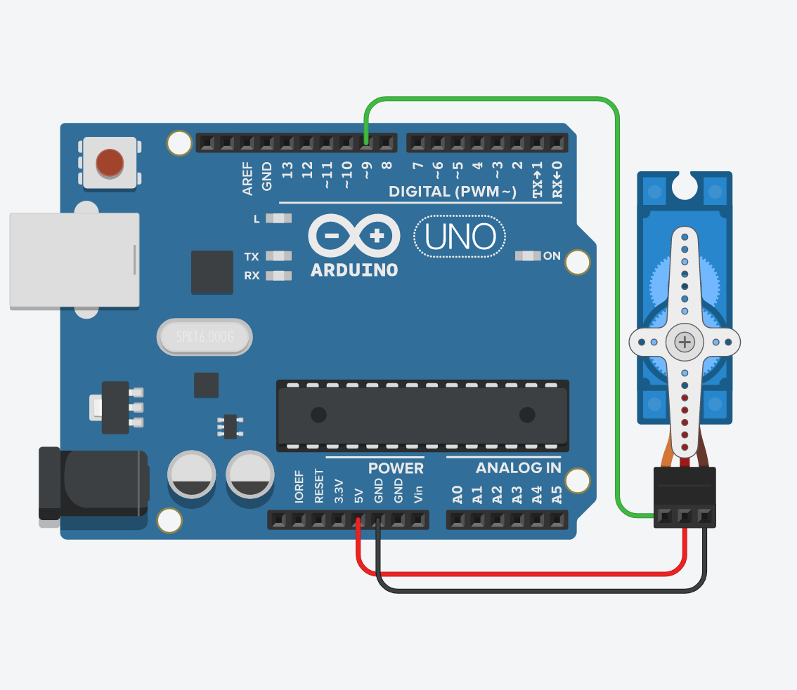

# 08. Servo



```ino
/*  08. Servo
        https://lastminuteengineers.com/servo-motor-arduino-tutorial
        https://www.arduino.cc/reference/en/libraries/servo/attach
*/
#include <Servo.h>

Servo servo;

void setup() {
  Serial.begin(9600);
  Serial.println("Type an angle (0-180), then press [Enter]");

  servo.attach(9);
  servo.write(0);   delay(400);
  servo.write(180); delay(600);
  servo.write(90);
}

void loop() {
  if (Serial.available()) {
    int angle = Serial.parseInt();
    Serial.println(angle);
    servo.write(angle);
  }
}
```
