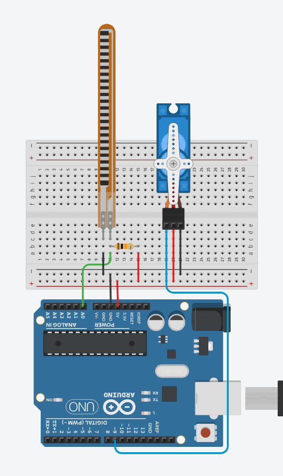

# 09. Flex sensor



```ino
/*  09. Flex sensor and servo
        https://lastminuteengineers.com/flex-sensor-arduino-tutorial
*/
#include <Servo.h>

Servo servo;

void setup() {
  Serial.begin(9600);
  servo.attach(9);
}

void loop() {
  int flex  = analogRead(A0);
  int angle = map(flex, 0, 1023, 0, 180);

  Serial.print(flex);
  Serial.print(", ");
  Serial.println(angle);

  servo.write(angle);
  delay(100);
}
```
