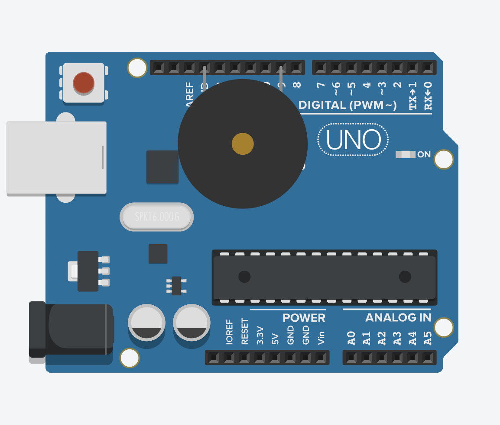

# 11. Buzzer



```ino
/*  11. Buzzer
        https://www.arduino.cc/reference/en/language/functions/advanced-io/tone
*/

#define BUZZER  9

char notes[] = {'B', 'B', 'B', ' ', 'B', 'B', ' ', 'B', 'B', 'B', ' '};
int  beats[] = { 1 ,  1 ,  1 ,  1 ,  2 ,  2 ,  1 ,  1 ,  1 ,  1 ,  8 };
int  tempo   = 150;

void setup() {
  pinMode(BUZZER, OUTPUT);
}

void loop() {
  for (int i = 0; i < 11; i++) {
    int t = beats[i] * tempo;
    tone(BUZZER, freq(notes[i]), t);      // tone(pin, freq, duration)
    delay(t);
    delay(tempo/10);
  }
}

int freq(char note) {
  int i;
  char notes[] = {'c', 'd', 'e', 'f', 'g', 'a', 'b', 'C', 'B'};
  int  freqs[] = {262, 294, 330, 349, 392, 440, 494, 523, 1975};

  for (int i = 0; i < 9; i++)
    if (notes[i] == note)
      return(freqs[i]);
  return(0);
}
```
