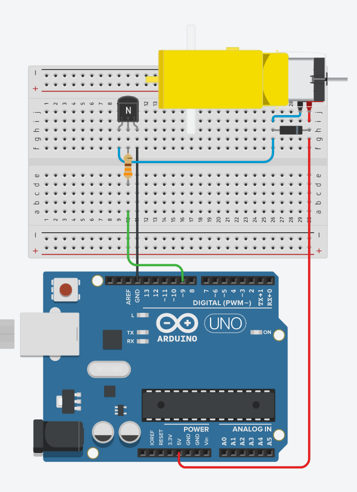

# 12. DC motor



```ino
/*  12. DC motor
        use switching transistor, because Arduino pin max current: 40 mA
        use flyback diode, to prevent high voltage spike on switch
        https://tinyurl.com/yg5x4fkx
*/
#define MOTOR   9

void setup() {
  pinMode(MOTOR, OUTPUT);
  Serial.begin(9600);
}

void loop() {
  analogWrite(MOTOR, 255);              // motor on (full speed)
  delay(3000);
  analogWrite(MOTOR, 0);                // motor off
  delay(3000);

  speedUpandDown();
  serialSpeed();
}

void speedUpandDown() {
  for (int i = 0; i <= 255; i++) {      // accelerate
    analogWrite(MOTOR, i);
    delay(20);
  }
  delay(1000);
  for (int i = 255; i >= 0; i--) {      // decelerate
    analogWrite(MOTOR, i);
    delay(20);
  }
}

void serialSpeed() {
  Serial.println("Type a speed (0-255), then press [Enter]");

  while (true) {
    if (Serial.available()) {
      int speed = Serial.parseInt();
      Serial.println(speed);
      analogWrite(MOTOR, speed);
    }
  }
}
```
