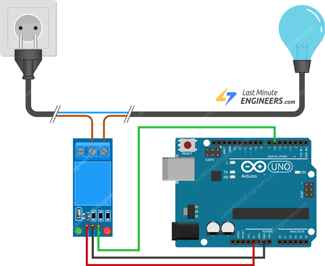

# 13. Relay Module



```ino
/*  13. Relay module
        https://lastminuteengineers.com/one-channel-relay-module-arduino-tutorial
*/
#define RELAY 6

void setup() {
  pinMode(RELAY, OUTPUT);
}

void loop() {
  digitalWrite(RELAY, LOW);             // activate relay
  delay(1000);
  digitalWrite(RELAY, HIGH);            // deactivate relay
  delay(3000);
}
```
