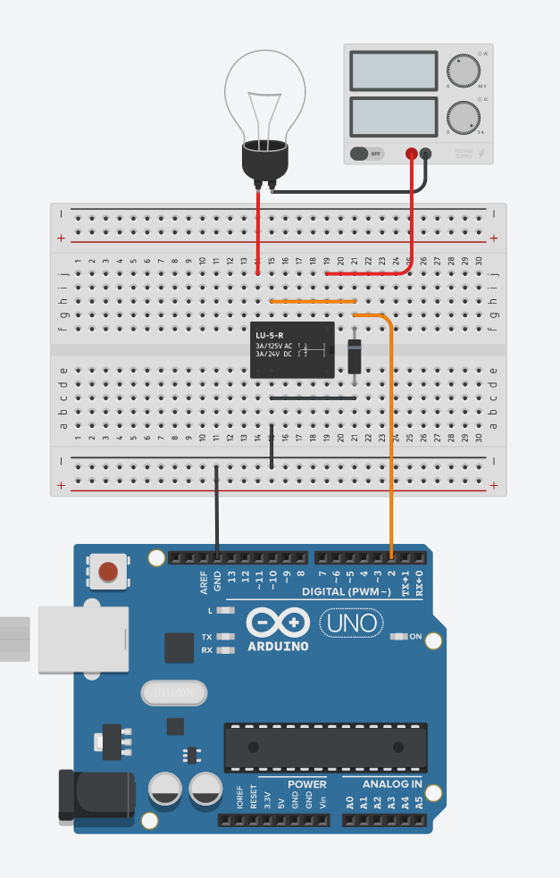

# 13. Relay



```ino
/*  13. Relay
        use flyback diode, to prevent high voltage spike on switch
        https://tinyurl.com/yhee9suc
*/
#define RELAY 2

void setup() {
  pinMode(RELAY, OUTPUT);
}

void loop() {
  digitalWrite(RELAY, HIGH);            // activate relay
  delay(1000);
  digitalWrite(RELAY, LOW);             // deactivate relay
  delay(3000);
}
```
