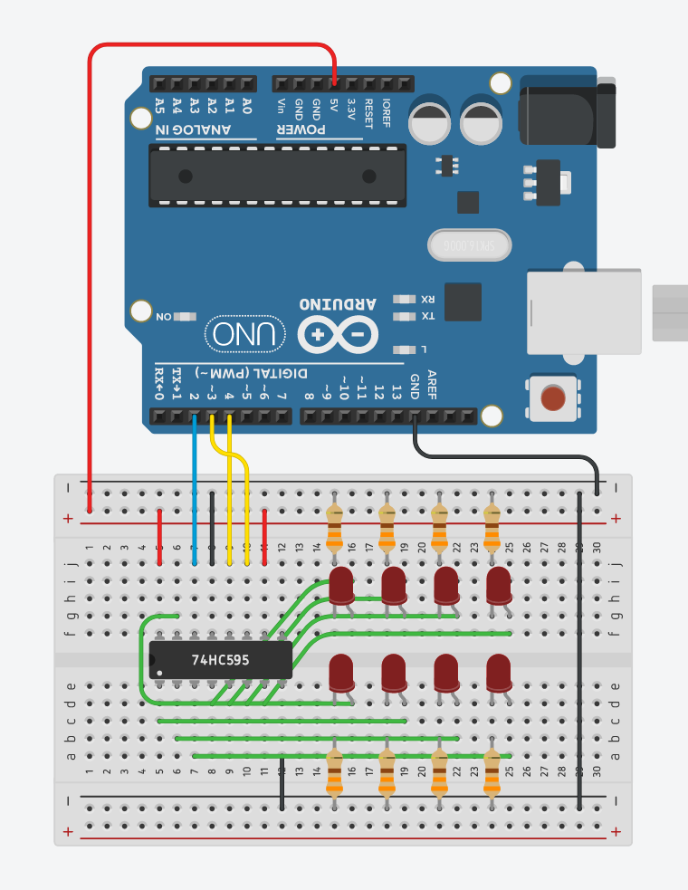

# 14. Shift register



```ino
/*  14. Shift register
        https://lastminuteengineers.com/74hc595-shift-register-arduino-tutorial/
*/

// serial peripheral interface (SPI) pin
#define DATA  2
#define CLOCK 3
#define LATCH 4

byte data = 0;

void setup() {
  pinMode(DATA, OUTPUT);
  pinMode(CLOCK, OUTPUT);
  pinMode(LATCH, OUTPUT);
}

void loop() {
  oneAfterAnother();
  //oneOnAtATime();
  //pingPong();
  //randomLED();
  //binaryCount();
}

void shiftWrite(int pin, boolean state) {
  bitWrite(data, pin, state);
  shiftOut(DATA, CLOCK, MSBFIRST, data);    // send 'data'
  digitalWrite(LATCH, HIGH);                // toggle output latch
  digitalWrite(LATCH, LOW);
}

void oneAfterAnother() {
  for (int i = 0; i <= 7; i++) {
    shiftWrite(i, HIGH);
    delay(100);
  }
  for (int i = 7; i >= 0; i--) {
    shiftWrite(i, LOW);
    delay(100);
  }
}

void oneOnAtATime() {
  for (int i = 0; i <= 7; i++) {
    shiftWrite(i, HIGH);
    delay(100);
    shiftWrite(i, LOW);
  }
}

void pingPong() {
  for (int i = 0; i <= 7; i++) {
    shiftWrite(i, HIGH);
    delay(100);
    shiftWrite(i, LOW);
  }
  for (int i = 7; i >= 0; i--) {
    shiftWrite(i, HIGH);
    delay(100);
    shiftWrite(i, LOW);
  }
}

void randomLED() {
  int i = random(8);
  shiftWrite(i, HIGH);
  delay(100);
  shiftWrite(i, LOW);
}

void binaryCount() {
  shiftOut(DATA, CLOCK, MSBFIRST, data);    // send 'data'
  digitalWrite(LATCH, HIGH);                // toggle output latch
  digitalWrite(LATCH, LOW);
  data++;
  delay(1000);
}
```
