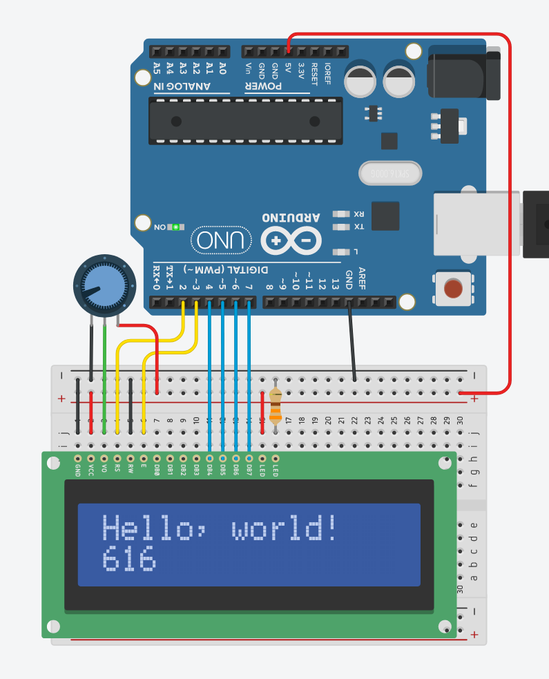
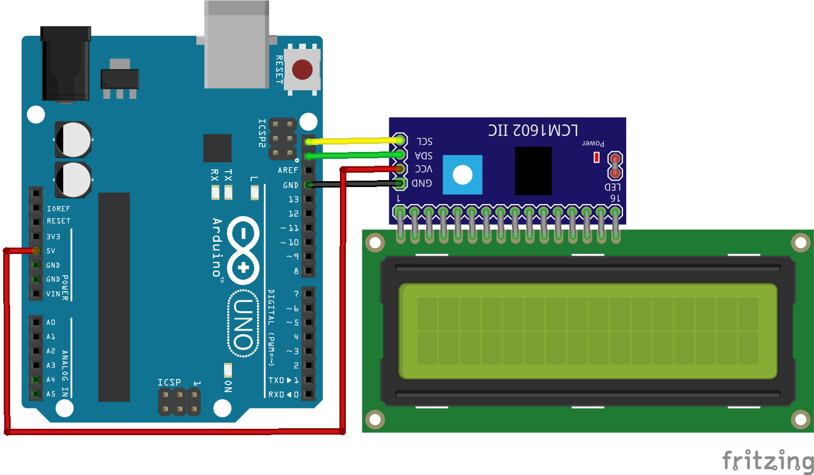
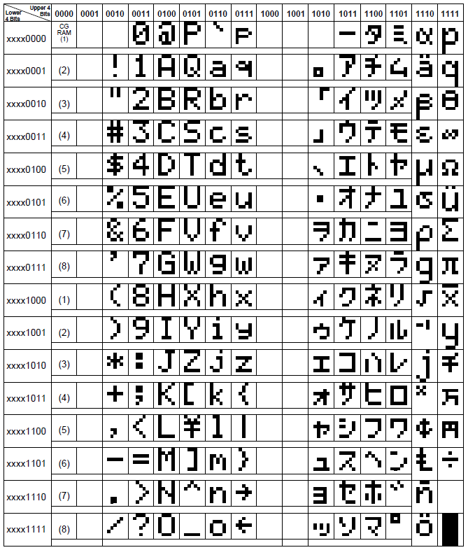

# 15. LCD screen



```ino
/* 15. LCD screen
       https://lastminuteengineers.com/arduino-1602-character-lcd-tutorial/
*/
#include <LiquidCrystal.h>

LiquidCrystal lcd(2, 3, 4, 5, 6, 7);    // rs, en, d4, d5, d6, d7

void setup() {
  lcd.begin(16, 2);                     // chars, rows
}

void loop() {
  lcd.clear();
  lcd.print("Time elapsed:");
  lcd.setCursor(0, 1);
  lcd.print(millis());
  delay(50);
}
```

# 15. LCD screen I2C



**I2C Wiring**

```
Device      Arduino     WeMos D1
------      -------     --------
VCC         5V          3V3/5V
GND         GND         G
SDA         SDA (A4)    SDA (D2)
SCL         SCL (A5)    SCL (D1)
```

```ino
/* 15. LCD screen I2C
       https://lastminuteengineers.com/i2c-lcd-arduino-tutorial
*/
#include <LiquidCrystal_I2C.h>

LiquidCrystal_I2C lcd(0x27, 16, 2);     // addr, chars, rows

void setup() {
  lcd.init();
  lcd.backlight();
}

void loop() {
  lcd.clear();
  lcd.print("Time elapsed:");
  lcd.setCursor(0, 1);
  lcd.print(millis());
  delay(50);
}
```

## LCD Character Codes


