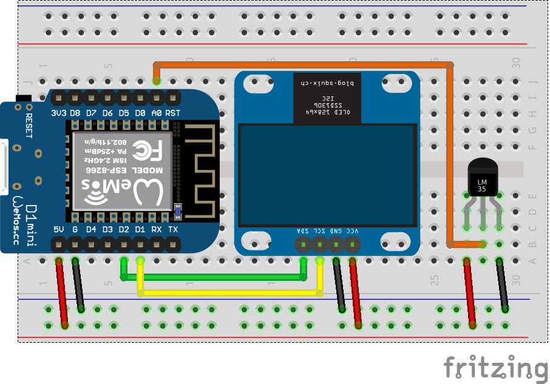

# 16. IoT temperature sensor



- Wemos D1 mini
- OLED 128x64 SSD1306
- LM35

```ino
#include <Adafruit_SSD1306.h>
#include <ESP8266WiFi.h>
#include <ESP8266HTTPClient.h>

Adafruit_SSD1306 oled(-1);
float            cTemp;

void setup() {
  oled.begin();
  oled.setTextColor(WHITE);
  WiFi.begin("SSID", "Password");
  while (WiFi.status() != WL_CONNECTED)
    delay(500);
  Serial.begin(115200);
  Serial.println(WiFi.localIP());
}

void loop() {
  float mV = analogRead(A0)/1024.0 * 3300;
  Tc = mV / 10;                             // LM35 output: 10 mV/°C
  show_temp();
  if (WiFi.status() == WL_CONNECTED)
    send_data();
  delay(30000);
}

void send_data() {
  WiFiClient client; HTTPClient http;
  http.begin(client, "http://api.thingspeak.com/update");
  http.addHeader("Content-Type", "application/x-www-form-urlencoded");
  int status = http.POST("api_key=________&field1=" + String(Tc) + "&field2=" + WiFi.RSSI());
  http.end();
  Serial.println(status);
}

void show_temp() {
  Serial.println(cTemp);
  oled.clearDisplay();
  oled.setCursor(0, 0);
  oled.setTextSize(2);
  oled.print(Tc);
  oled.print("'C");
  oled.display();
}
