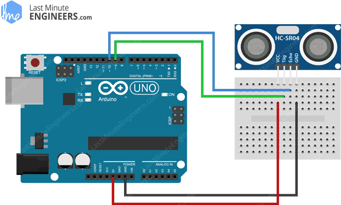

# 17. Sonar



```ino
/*  17. Ultrasonic sensor
        https://lastminuteengineers.com/arduino-sr04-ultrasonic-sensor-tutorial
*/

#include <NewPing.h>

#define TRIG      9
#define ECHO      10

NewPing sonar(TRIG, ECHO);

void setup() {
  Serial.begin(9600);
}

void loop() {
  int dist = sonar.ping_cm();
  Serial.println(dist);
  delay(500);
}
