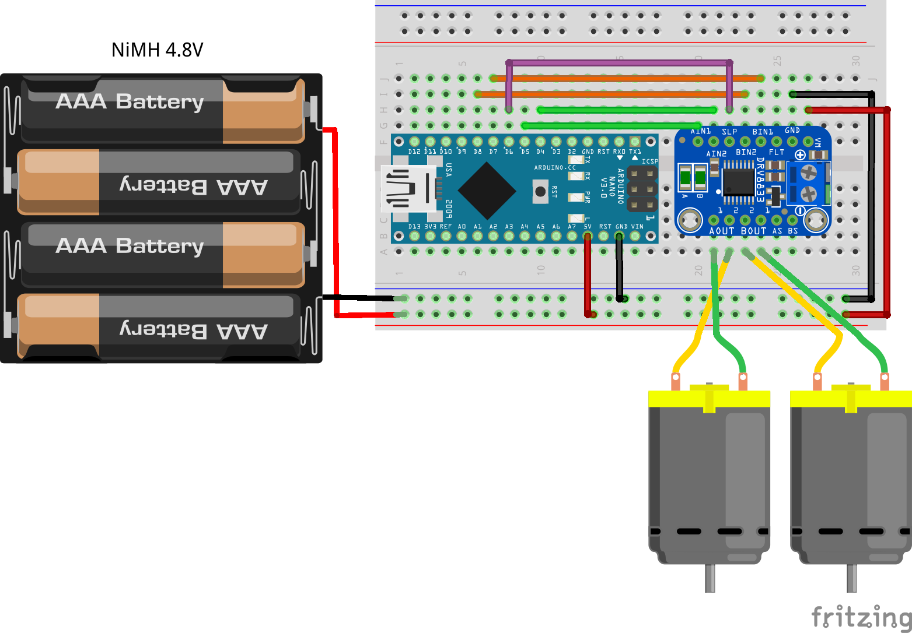

# 19. Motor driver DRV8833



- Arduino Uno/Nano
- Chassis robot 2WD <https://www.tokopedia.com/solarperfect/motor-smart-robot-car-chassis-kit-2wd-arduino-smarcar-wheel-2-wd>
- Motor driver: DRV8833 <https://www.tokopedia.com/avarelectric/drv8833-dual-h-bridge-dc-drive-drv-8833-mini-motor-driver-module-merah>

DRV8833 tidak bisa mengeluarkan PWM. Untuk keluaran PWM gunakan motor driver TB6621FNG.

```ino
/*  19. Motor driver
        https://electropeak.com/learn/interfacing-drv8833-dual-motor-driver-module-with-arduino/

    Uno/Nano  DRV8833   MotorR  MotorL
    --------  -------   ------  ------
    5V        VM
    Gnd       Gnd
    D4        AIN2
    D5        AIN1
    D6        STBY
    D7        BIN1
    D8        BIN2
              A01       Pin1
              A02       Pin2
              B02               Pin2
              B01               Pin1
*/

#define AIN2 4
#define AIN1 5
#define STBY 6
#define BIN1 7
#define BIN2 8

void setup() {
  pinMode(AIN1, OUTPUT);
  pinMode(AIN2, OUTPUT);
  pinMode(BIN1, OUTPUT);
  pinMode(BIN2, OUTPUT);
  pinMode(STBY, OUTPUT);
}

void loop() {
  forward(1000);
  delay(1000);

  back(1000);
  delay(1000);
}

void forward(int t) {
  digitalWrite(AIN1, HIGH); digitalWrite(AIN2, LOW);
  digitalWrite(BIN1, HIGH); digitalWrite(BIN2, LOW);
  digitalWrite(STBY, HIGH);
  delay(t);
  digitalWrite(STBY, LOW);
}

void back(int t) {
  digitalWrite(AIN1, LOW); digitalWrite(AIN2, HIGH);
  digitalWrite(BIN1, LOW); digitalWrite(BIN2, HIGH);
  digitalWrite(STBY, HIGH);
  delay(t);
  digitalWrite(STBY, LOW);
}

// TODO: right(t), left(t)
```
